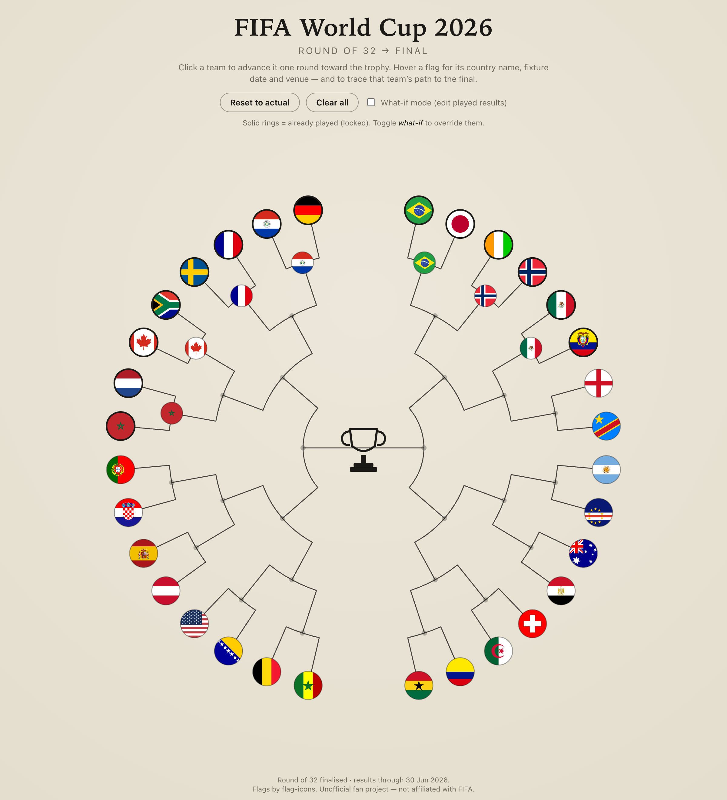
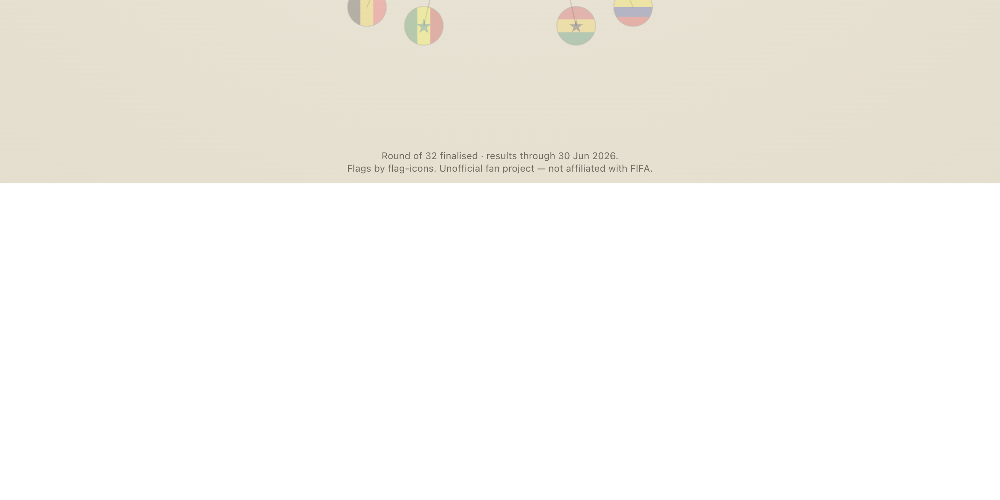
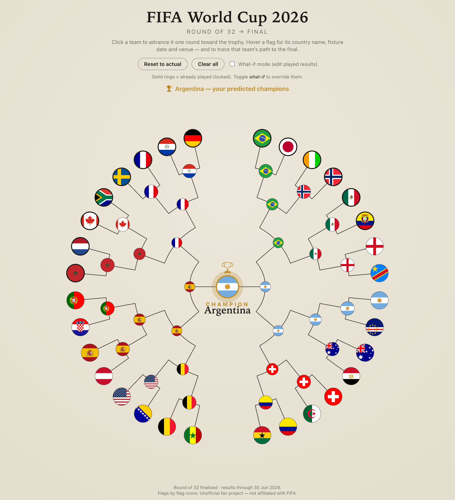
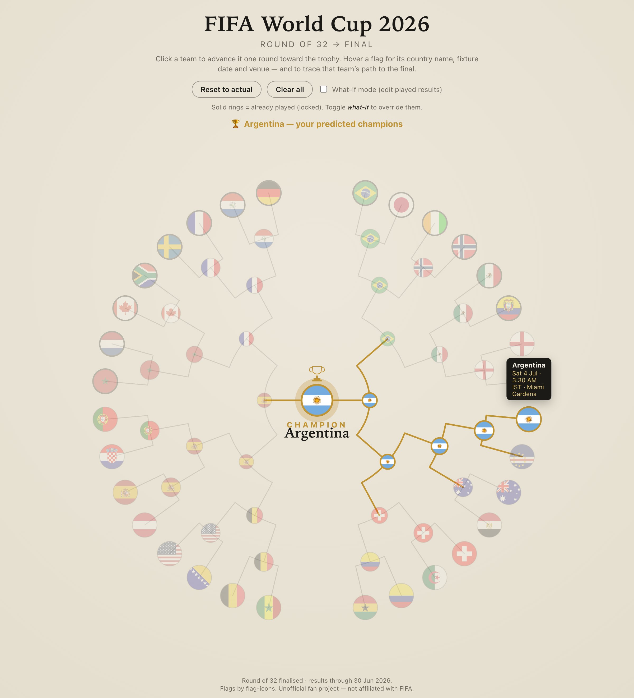

# FIFA World Cup 2026 — Circular Bracket Visualiser

An interactive **circular (radial) knockout bracket** for the 2026 FIFA World Cup. All 32 nations of
the finalised Round of 32 sit around the rim as circular flags; elbow connectors collapse inward
through the Round of 16, quarter-finals, semi-finals and final to the trophy at the centre. Results
already played are seeded in; the rest of the bracket is yours to predict, all the way to a champion.



## Features

- **Faithful radial layout** — 32 flags positioned by polar geometry, left and right halves meeting
  at the central trophy, recreating the reference design.

- **Hover for the details** — every flag shows a tooltip (and an accessible `<title>` / `aria-label`)
  with the country name, the **fixture date, kickoff time (IST) and venue**, and — for matches already
  played — the scoreline. It only appears on hover, so the bracket itself stays uncluttered.

  

- **Prediction mode** — click a team to advance it one round toward the trophy. Picks cascade:
  changing an earlier result automatically clears everything downstream that depended on it. When the
  final is decided, the winner is crowned at the centre.

  

- **Trace a path to the final** — hovering a team lights up its entire route through the bracket and
  dims everything else.

  

- **Real results pre-filled** — matches already played (through 30 June 2026) are seeded and
  **locked** with their scores:
  - Canada 1–0 South Africa
  - Brazil 2–1 Japan
  - Germany 1–1 Paraguay _(Paraguay won 4–3 on penalties)_
  - Netherlands 1–1 Morocco _(Morocco won 3–2 on penalties)_
  - Côte d'Ivoire 1–2 Norway
  - Mexico 2–0 Ecuador
  - France 3–0 Sweden
- **What-if mode** — a toggle unlocks the played results so you can rewrite history.
- **Reset to actual** / **Clear all** controls, with your predictions persisted to `localStorage`.
- **Responsive & accessible** — scalable SVG, keyboard-focusable nodes, offline-bundled flags.

## Tech stack

React 19 · TypeScript · Vite. Flags are bundled from [`flag-icons`](https://github.com/lipis/flag-icons)
(no external CDN — works fully offline). No other runtime dependencies.

## Getting started

```bash
npm install
npm run dev        # http://localhost:5173
```

Other scripts:

```bash
npm run build      # type-check (tsc -b) + production build to dist/
npm run preview    # serve the production build locally
npm run lint       # oxlint
```

## Project structure

```
src/
  data/        teams.ts (32 teams), bracket.ts (seed: pairings, fixtures, results), flags.ts (bundled SVGs)
  lib/         bracketState.ts (knockout tree + cascade logic), geometry.ts (polar layout),
               format.ts (scoreline + IST fixture strings)
  hooks/       useBracket.ts (prediction state + localStorage)
  components/  Bracket, FlagNode, MatchConnector, Trophy, Tooltip, Controls
```

## Updating the data

The bracket is a static seed. To change teams, pairings, fixtures or results, edit
[`src/data/bracket.ts`](src/data/bracket.ts) (the 16 Round of 32 matches, ordered right half then
left half) and [`src/data/teams.ts`](src/data/teams.ts) (team names + `flag-icons` codes). Each match
carries a `kickoffUTC` instant (rendered in IST) and a host `venue`; add a `result` to a match to mark
it played and lock it.

## Deploying

The build is fully static — deploy `dist/` to any static host (Vercel, Netlify, GitHub Pages). For
**GitHub Pages** under a repo subpath, set Vite's base in `vite.config.ts`:

```ts
export default defineConfig({ plugins: [react()], base: '/fifa-circular-bracket-visualiser/' });
```

## Data sources

Round of 32 pairings, fixtures and results confirmed against Wikipedia, ESPN, CBS Sports, Yahoo Sports
and Olympics.com coverage of the 2026 FIFA World Cup knockout stage. Kickoff times were given in ET and
are stored as UTC instants, then displayed in IST.

---

Unofficial fan project. Not affiliated with or endorsed by FIFA. Flags © the
[`flag-icons`](https://github.com/lipis/flag-icons) project.
